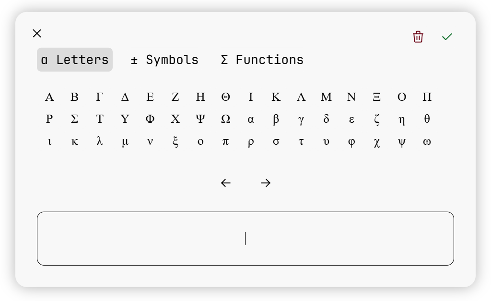

# GUIMath 
Create mathematical equations on a webpage using a GUI similar to Microsoft Word or Google Docs.

> [!NOTE]
> This project was previously developed as MJXGUI and distributed as a standalone script. With this release, the library has been renamed and repackaged as GUIMath, starting from a new release cycle at v0.1.0.
> 
> GUIMath v0.1.0 is equivalent to MJXGUI v2.1.0

GUIMath is a widget style application meant to give users a graphical interface for creating equations 
to use on the web. It uses MathJax as a core dependency and as an external renderer to show users a preview 
of their equation as they are building it.  

It then generates LaTeX for the entered equation for you to handle however you want.

Documentation is at [hrus.in/guimath](https://hrus.in/guimath)

# Features
- Build mathematical, physical, and chemical equations using a GUI, similar to inserting equations in 
editors like Microsoft Word or Google Docs.
- Convert an HTML text input into an interactive "equation" input.
- Support for common symbols, Greek letters, common math functions and operators.
- Write your own functions, operators, and characters to add support for those not available out of the box.
- Convert created equations into LaTeX for storage and rendering in the browser.

# Contributing
Please read [CONTRIBUTING.md](docs/contributing.md) to get started.
